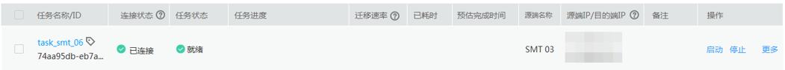

# 快速入门<a name="sms_api_0011"></a>

## 概述<a name="section449316520610"></a>

本节通过调用创建迁移任务API创建一个迁移任务，介绍使用SMS API的基本流程。

创建迁移任务的流程如下：

1.  调用[Token认证](认证鉴权.md#zh-cn_topic_0121671869_section2417768214391)接口获取用户Token，因为在后续的请求中需要将Token放到请求消息头中作为认证。
2.  参见[安装迁移Agent](https://support.huaweicloud.com/sms_faq/sms_faq_0020.html)，安装迁移Agent在预先准备的服务器上\(该服务器需要能访问公网\)。
3.  参见[查询源端服务器列表](查询源端服务器列表.md)，在查询到的源端服务器列表中，获取待迁移的源端服务器ID。
4.  选取一台ECS弹性云服务器作为目的端服务器，获取该目的端服务器的ID。
5.  调用创建迁移任务接口创建一个迁移任务。

    创建成功后，可登录到管理控制台查看已创建的迁移任务。


## 前提条件<a name="section178273161713"></a>

-   已获取IAM的Endpoint，具体请参见[地区和终端节点](https://developer.huaweicloud.com/endpoint)。
-   已获取SMS的Endpoint，具体请参见[地区和终端节点](https://developer.huaweicloud.com/endpoint)。
-   已获取项目ID，具体请参见[获取项目ID](获取项目ID.md)。
-   已获取目的端服务器所在区域的Region ID，即目的端服务器所在区域的默认项目名。

## 操作步骤<a name="section388023718717"></a>

1.  调用[Token认证](认证鉴权.md#zh-cn_topic_0121671869_section2417768214391)接口获取用户Token，并设置成环境变量，Token用于后续调用其他接口鉴权。
    1.  执行以下命令，获取用户Token。

        ```
        curl -X POST https://{iam_endpoint}/v3/auth/tokens -H 'content-type: application/json' -d '{
            "auth": {
                "identity": {
                    "methods": [
                             "password"
                     ],
                     "password": {
                            "user": {
                            "name": "{user_name}",
                                   "domain": {
                                         "name": "{user_name}"
                                   },
                    "password": "{password}"
                             }
                     }
                  },
                  "scope": {
                       "project": {
                             "id": "{project_id}"
                         }
                  }
              }
             }' -vk
        ```

        上述命令中，部分参数请参见以下说明进行修改（具体请参考_《统一身份认证服务API参考》_）：

        -   _**\{iam\_endpoint\}**_替换为前提条件中获取的IAM的Endpoint。
        -   _**\{project\_id\}**_替换为前提条件中获取的项目ID。
        -   **\{_user\_name\}_**和**\{_password\}_**分别替换为连接IAM服务器的用户名和密码。

        响应Header中“X-Subject-Token”的值即为Token：

        ```
        X-Subject-Token:MIIDkgYJKoZIhvcNAQcCoIIDgzCCA38CAQExDTALBglghkgBZQMEAgEwgXXXXX...
        ```

    2.  使用如下命令将token设置为环境变量，方便后续事项。

        **export Token=_\{_**_**X-Subject-Token\}**_

        **X-Subject-Token**即为上一步骤获取到的token，命令示例如下。

        ```
        export Token=MIIDkgYJKoZIhvcNAQcCoIIDgzCCA38CAQExDTALBglghkgBZQMEAgEwgXXXXX...
        ```

2.  安装Linux版的SMS-Agent，具体操作请参考[安装Linux版的SMS-Agent](https://support.huaweicloud.com/qs-sms/sms_02_0004.html)。
3.  <a name="li8965205162012"></a>查询源端服务器的ID，具体操作请参考[查询源端服务器列表](查询源端服务器列表.md)。在查询到的源端服务器列表中，获取待迁移的源端服务器ID。
4.  <a name="li931221211207"></a>根据目的端服务器的ID，参照[获取项目ID](获取项目ID.md)获取该弹性云服务器的项目ID。
5.  调用[创建迁移任务](创建迁移任务.md)接口创建一个迁移任务。

    以Linux系统为例创建迁移任务。

    ```
    curl -X POST https://{sms_endpoint}/v1.0/tasks -H 'content-type: application/json' -H "x-auth-token: $Token" -d '
    {
    "name": "Linux Migration",
    "type": "MIGRATE_FILE",
    "priority": "1",
    "speed_limit": "0",
    "start_target_server": "true",
    "os_type": "LINUX",
    "float_ip": "x.x.x.x",
    "region_name": "north-china",
    "region_id": "{region_id}",
    "project_name": "cn-north-1",
    "project_id": "{project_id}",
    "source_server": {
    "id": "{id}"
    },
    "target_server": {
    "vm_id": "{vm_id}",
    "disks": [{
    "name": "Disk 0",
    "disk_id": "e198f4cc-e51a-43df-1234-79bd41e00bed",
    "size": "85897247744",
    "physical_volumes": [{
    "name": "xvda1",
    "size": "104857088"
    }, {
    "name": "xvda2",
    "size": "85792390656"
    }
    ]
    }, {
    "name": "Disk 1",
    "disk_id": "e198f4cc-1234-43df-1234-79bd41e00bed",
    "size": "214745218048",
    "physical_volumes": [{
    "name": "xvdb1",
    "size": "109888667136"
    }, {
    "name": "xvdb2",
    "size": "104856550912"
    }
    ]
    }
    ]
    }
    }
    -vk
    ```

    上述命令中，部分参数请参见以下说明进行修改（其他参数为自定义参数，请根据[创建迁移任务](创建迁移任务.md)中的参数解释进行设置）：

    -   **_\{region\_id\}_**替换为目的端服务器所在区域的默认项目名。
    -   **_\{project\_id\}_**替换为[4](#li931221211207)中查询到的项目ID。
    -   **_\{id\}_**替换为[3](#li8965205162012)中查询到的待迁移的源端服务器ID。
    -   **_\{vm\_id\}_**替换为目的端服务器ID。

6.  迁移任务创建完成后，您可以在SMS的“任务管理”界面查看到该迁移任务。

    **图 1**  查看迁移任务<a name="fig3600112718597"></a>  
    


