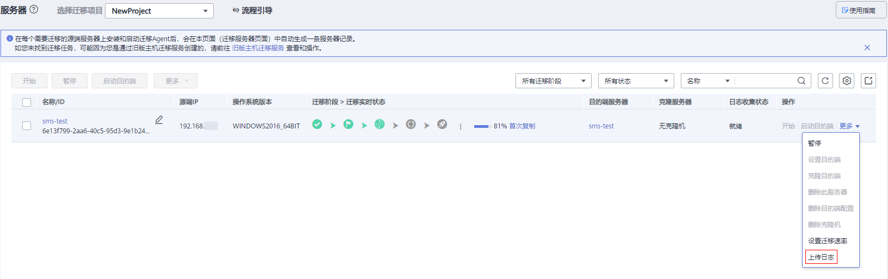
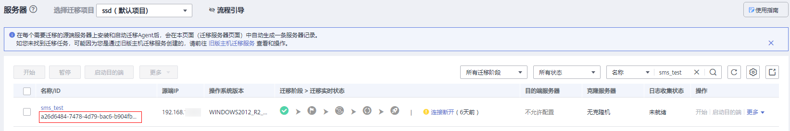

# 上传迁移日志

## 操作场景

当您创建的迁移任务执行失败，需要主机迁移服务技术支持协助您解决时，为了方便技术人员定位问题，您可以通过上传迁移日志功能把日志发给主机迁移服务。使用上传日志功能时，Agent会将任务日志上传到您选择的OBS桶里，并把日志授权给SMS服务。SMS服务下载日志后，Agent会自动删除您选择的OBS桶中的日志。迁移日志上传成功以后，您可以通过创建工单的方式反馈问题。

## 前提条件

-   开始服务器复制后，才可进行上传迁移日志的操作。
-   此迁移任务的日志收集状态为“未就绪”、“就绪”、“通知agent搜集日志”、“通知Agent取消日志授权”、“日志收集完成”、“日志收集失败”。
-   上传迁移日志前，请确保已创建OBS桶。

## 操作步骤

1.  登录管理控制台。
2.  单击“服务列表”，选择“迁移 \> 主机迁移服务”。

    进入“主机迁移服务”页面。

3.  在左侧导航树中，选择“服务器”。

    进入服务器列表页面。

4.  单击待上传日志的服务器所在行的操作列的“更多 \> 上传日志”。

    进入“上传日志”页面。

    **图 1**  上传日志  
    

5.  在“上传日志”页面，选择一个OBS桶用于存放上传的日志，单击“确认”。

    当日志收集状态为“日志收集成功”时，表示上传迁移日志成功。

    **图 2**  确认上传  
    

6.  （可选）[提交工单](https://console.huaweicloud.com/ticket/?region=cn-north-1&locale=zh-cn#/ticketindex/createIndex)时，请添加上源端ID。

    

