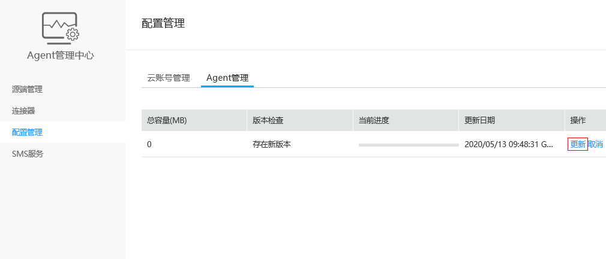
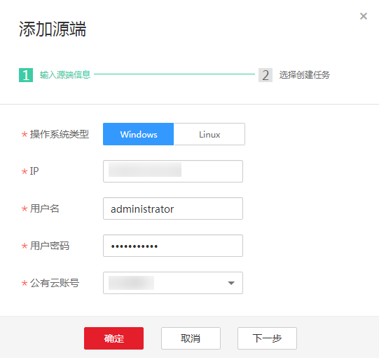
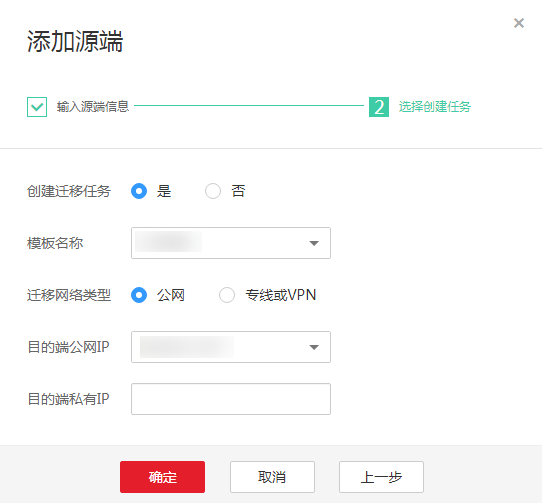

# 使用Agent批量管理工具

## 操作场景

本章节指导用户如何使用Agent批量管理工具批量推送并自动安装Agent到源端服务器并开始迁移任务。

## 前提条件

-   已参考[安装Agent批量管理工具](安装Agent批量管理工具.md)安装好Agent批量管理工具。
-   源端服务器为Windows系统时，安全组开放TCP协议的445、3389端口。

    源端服务器为Linux系统时，需要提前安装好rsync组件。

-   目的端服务器为Windows系统时，安全组开放TCP协议8899、8900端口。

    目的端服务器为Linux系统时，安全组开放SSH端口（默认为22端口）。

## 操作步骤

1.  在浏览器中输入Agent管理中心地址，如https://192.168.0.1:8443，输入账号密码，单击“登录”。

    > **说明：** 
    >-   192.168.0.1仅为示例说明，请输入实际的IP地址。
    >-   首次登录需要先注册后才能登录。

2.  单击左侧导航栏的“配置管理”，进入“配置管理”界面。
3.  在“Agent管理”页，单击操作列的“更新”，更新Agent。

    **图 1**  更新Agent  
    

4.  单击右上角的“添加账号”，输入华为云账号、访问密钥ID（AK）、秘密访问密钥（SK），单击“确定”。

    > **须知：** 
    >-   该账号为目的端华为云账号与AK/SK。
    >-   请确保输入的华为云账号、AK、SK正确，请参考[如何获取AK/SK？（账号）](https://support.huaweicloud.com/sms_faq/sms_faq_0032.html)或[如何获取AK/SK？（IAM用户）](https://support.huaweicloud.com/sms_faq/sms_faq_0012.html)。

5.  添加源端。
    1.  单击“源端管理 \> 添加源端”，配置源端服务器参数，配置完成后，单击“下一步”。

        **图 2**  添加源端  
        

        > **说明：** 
        >-   推送及安装Agent到源端服务器的速度依赖于网络带宽速度，Windows系统为5-10左右，Linux系统在3-5分钟左右。
        >-   推送Agent请确保连机器保持“在线”状态。

    2.  在选择创建任务界面，选择模板及目的端公网IP/目的端私有IP，单击“确定”。

        **图 3**  创建迁移任务  
        

        > **说明：** 
        >-   此处的模板为SMS中的模板。
        >-   迁移时创建服务器的密码为1 + sk前八位 + !。如sk前八位为RgybsdPP，则密码为1RgybsdPP!。

6.  批量添加源端。

    单击“源端管理 \> 批量添加源端”，下载模板，在“源端信息”页，按要求填写源端和目的端服务器信息。填写完成后，上传文件。

    当Agent状态显示已安装，连接状态显示已连接，说明Agent已推送到源端服务器中。

7.  登录SMS管理控制台，即可查看已添加的源端服务器及连接状态。

## 源端管理界面相关操作说明

-   连接到SMS：当源端连接状态为“失去连接”时，点单击此按钮可以重新连接。
-   卸载：卸载安装在源端的Agent。
-   修改：源端服务器密码修改后，修改源端信息。
-   删除：卸载安装在源端的Agent，并删除相关记录。
-   推送/升级: 升级或重新推送Agent到源端。

    > **说明：** 
    >源端Agent 在7天内没有迁移任务时，会主动断开连接状态，需要重新“连接到SMS”。

