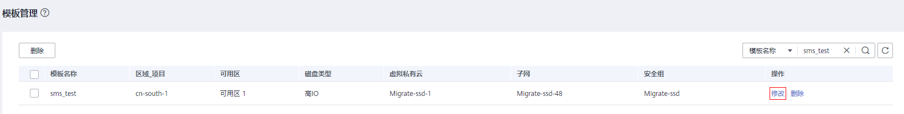

# 修改模板

## 操作场景

当保存的模板不再符合您的业务要求时，您可以随时登录管理控制台修改模板。

## 操作步骤

1.  登录管理控制台。
2.  单击“服务列表”，选择“迁移 \> 主机迁移服务”。

    进入“主机迁移服务”页面。

3.  在左侧导航树中，选择“模板管理”。

    进入“模板管理”页面。

4.  在“模板管理”页面单击模板名称操作列的“修改”，进入修改模板页面。

    **图 1**  修改  
    

5.  在修改模板页面，根据业务要求，修改虚拟私有云、网卡、安全组、可用区及磁盘类型信息。修改完成后，单击“确定”。

    **图 2**  修改模板  
    

