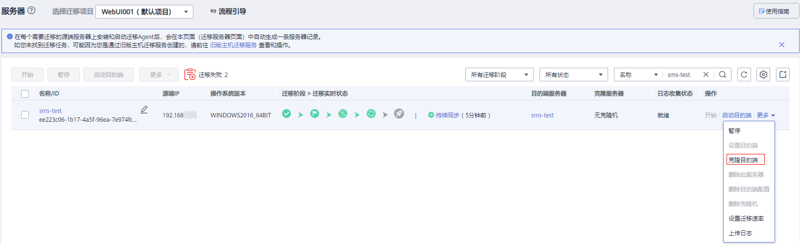
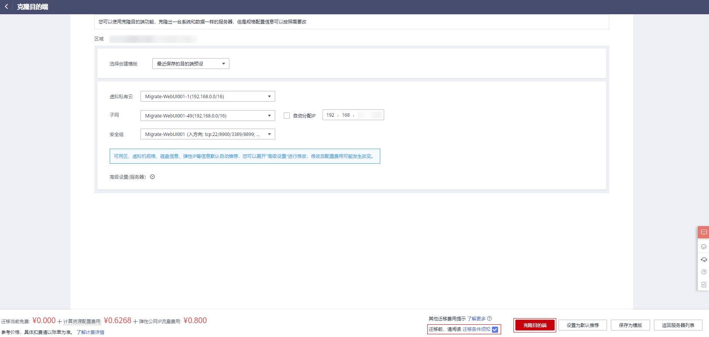

# 克隆目的端

## 操作场景

启动目的端前，您可单击“克隆服务器”克隆出一台新的弹性服务器进行业务测试，测试无误后再启动目的端。

> **说明：** 
>克隆出的服务器必须和目的端服务器在同一可用区，但可以处于另外一个VPC中。

## 前提条件

只有“迁移阶段 \> 迁移实时状态”为“持续同步”时才可启动目的端。

## 操作步骤

1.  登录管理控制台。
2.  单击“服务列表”，选择“迁移 \> 主机迁移服务”。

    进入“主机迁移服务”页面。

3.  单击“体验新版（NEW）”，进入新版主机迁移服务控制台。
4.  在左侧导航树中，选择“服务器”。

    进入服务器列表页面。

5.  在服务器列表页面找到已复制完成并持续同步的服务器，单击“操作”列下“更多 \> 克隆目的端”。

    **图 1**  克隆目的端  
    

6.  在弹出的“克隆目的端”页面，选择模板后，仔细阅读并勾选“迁移前，请阅读迁移条件须知”，单击“克隆目的端”。

    **图 2**  配置参数  
    

7.  当“克隆服务器”列显示具体的克隆机名称，说明“克隆目的端”已完成。

