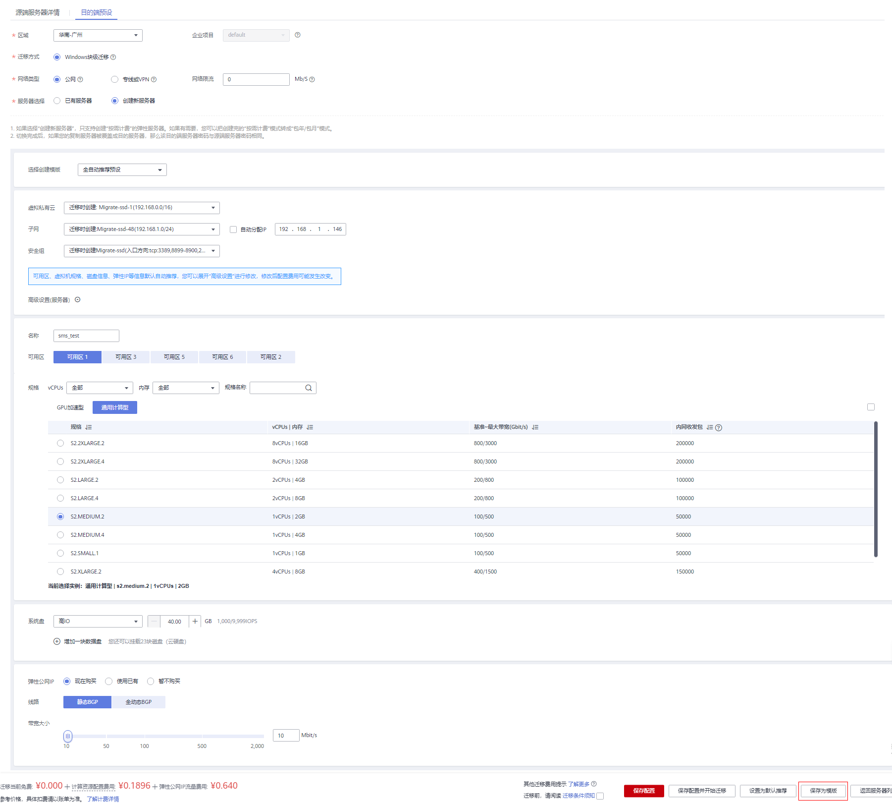
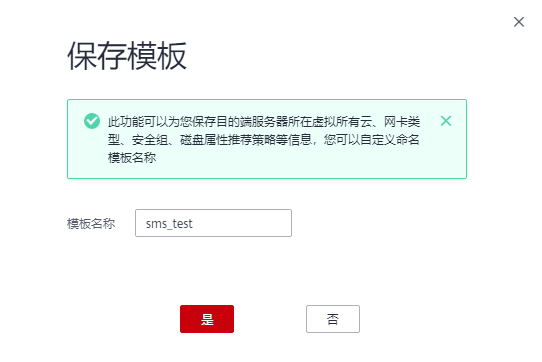

# 创建模板

## 操作场景

设置目的端时选择创建新服务器，可选择已创建的模板参数来创建服务器。

## 约束限制

已安装Agent，且未设置目的端服务器。

## 操作步骤

1.  登录管理控制台。
2.  单击“服务列表”，选择“迁移 \> 主机迁移服务”。

    进入“主机迁移服务”页面。

3.  在左侧导航树中，选择“服务器”。

    进入服务器列表页面。

4.  在服务器列表页面找到待迁移的服务器，在“目的端服务器”列下单击，设置目的端服务器。

    或单击服务器列表页“操作”列的“更多 \> 设置目的端”，设置目的端服务器。

5.  在“目的端预设”页面，服务器选择项选择“创建新服务器”。

    模板选择自动创建，虚拟私有云、网卡与安全组默认为自动创建，也可以根据需求手动选择。高级配置中名称、可用区、规格、系统盘、弹性公网IP默认自动推荐，也可以根据需求手动选择。设置完成后，单击“保存为模板”。

    **图 1**  创建新服务器  
    

    > **说明：** 
    >-   虚拟私有云选择自动创建时，SMS会帮助用户创建一个VPC：
    >    若源端IP是192.168._X.X_，则推荐创建的VPC网段是192.168.0.0/16，同时创建一个子网，网段也是192.168.0.0/16。
    >    若源端IP是172.16._X.X_，则推荐创建的VPC网段是172.16.0.0/12，同时创建一个子网，网段也是172.16.0.0/12。
    >    若源端IP是10._X_._X.X_，则推荐创建的VPC网段是10.0.0.0/8，同时创建一个子网，网段也是10.0.0.0/8。
    >-   安全组选择自动创建时，则SMS服务会自动创建一个安全组，并根据SMS的需要开放端口，Windows开放8899、8900端口，Linux系统开放8900、22端口。

6.  在弹出的保存模板窗口，单击“是”。

    下次需要迁移的时候，设置目的端时，选择新创建服务器，可选择之前保存的模板。

    **图 2**  保存模板  
    

