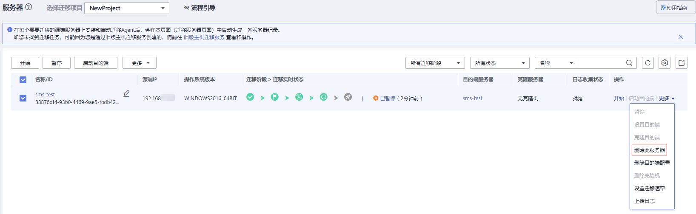
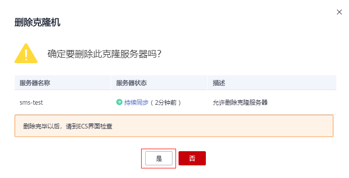

# 删除克隆机

## 操作场景

业务测试完成后或不再需要克隆机，您可参考本章节删除克隆机。

> **说明：** 
>删除克隆机后，请到弹性云服务器Console界面检查。

## 操作步骤

1.  登录管理控制台。
2.  单击“服务列表”，选择“迁移 \> 主机迁移服务”。

    进入“主机迁移服务”页面。

3.  在左侧导航树中，选择“服务器”。

    进入服务器列表页面。

4.  在服务器列表页面选择需要删除克隆机的服务器，单击“操作”列下“更多 \> 删除克隆机”。

    **图 1**  删除克隆机  
    

5.  在弹出的“删除克隆机”页面，单击“是”。

    **图 2**  确定删除  
    

