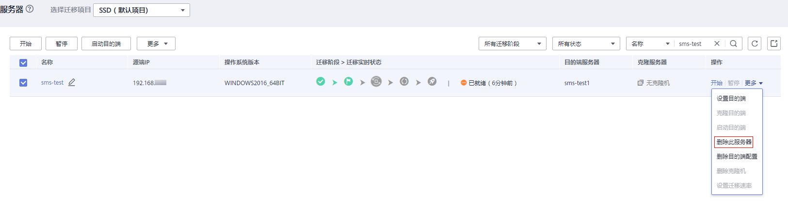

# 删除服务器

## 操作场景

您可根据业务需求，删除服务器。

> **注意：** 
>删除服务器以后，如果您想再进行注册，需要重启Agent。

## 操作步骤

1.  登录管理控制台。
2.  单击“服务列表”，选择“迁移 \> 主机迁移服务”。

    进入“主机迁移服务”页面。

3.  单击“体验新版（NEW）”，进入新版主机迁移服务控制台。
4.  在左侧导航树中，选择“服务器”。

    进入服务器列表页面。

5.  在服务器列表页面选择需要删除服务器，单击“操作”列下“更多 \> 删除此服务器”。

    或勾选需要删除的服务器，单击服务器列表上方的“更多 \> 删除此服务器”。

    **图 1**  删除此服务器  
    

6.  在弹出的“删除此服务器”页面，单击“是”。

    **图 2**  确定删除  
    

