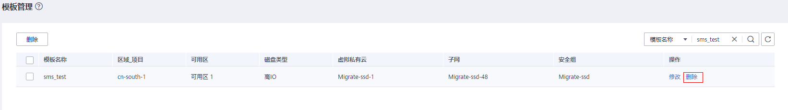
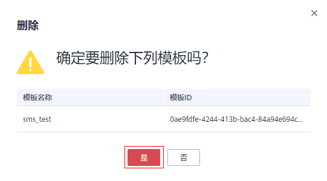

# 删除模板

## 操作场景

当不再需要模板时，您可以随时登录管理控制台删除模板。

## 操作步骤

1.  登录管理控制台。
2.  单击“服务列表”，选择“迁移 \> 主机迁移服务”。

    进入“主机迁移服务”页面。

3.  在左侧导航树中，选择“模板管理”。

    进入“模板管理”页面。

4.  在“模板管理”页面单击模板名称操作列的“删除”，进入删除模板页面。

    **图 1**  删除  
    

5.  在弹出的删除模板页面，单击“确定”，即可删除模板。

    **图 2**  删除模板  
    

