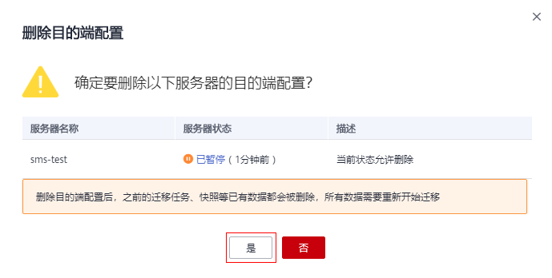

# 删除目的端配置

## 操作场景

当目的端设置错误或因业务需求需要修改目的端配置时，可以参考本章节删除目的端，然后重新设置目的端。

> **说明：** 
>删除目的端配置后，之前的迁移任务、快照等已有数据都会被删除，所有数据需要重新开始迁移。

## 操作步骤

1.  登录管理控制台。
2.  单击“服务列表”，选择“迁移 \> 主机迁移服务”。

    进入“主机迁移服务”页面。

3.  单击“体验新版（NEW）”，进入新版主机迁移服务控制台。
4.  在左侧导航树中，选择“服务器”。

    进入服务器列表页面。

5.  在服务器列表页面选择需要删除目的端配置的服务器，单击“操作”列下“更多 \> 删除目的端配置”。

    或勾选需要删除目的端配置的服务器，单击服务器列表上方的“更多 \> 删除目的端配置”。

    **图 1**  删除目的端配置  
    

6.  在弹出的“删除目的端配置”页面，单击“是”。

    **图 2**  确定删除  
    

