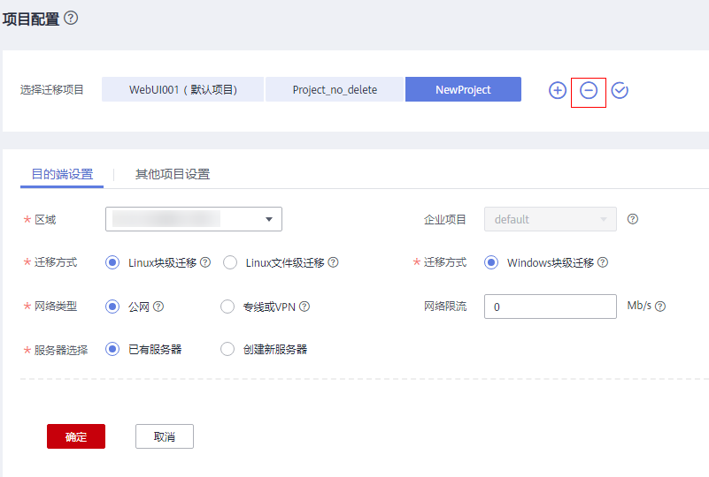
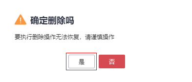

# 删除迁移项目

当该迁移项目已完成或不再需要该迁移项目时，您可以删除该项目。

> **注意：** 
>该迁移项目下有服务器时禁止删除迁移项目。

## 删除迁移项目

1.  登录管理控制台。
2.  单击“服务列表”，选择“迁移 \> 主机迁移服务”。

    进入“主机迁移服务”页面。

3.  在左侧导航树中，选择“项目配置”。
4.  选择要删除的迁移项目名称，单击名称右侧的。

    **图 1**  删除项目  
    

5.  在弹出的确定删除迁移项目页，单击**“是”**。

    **图 2**  确定删除  
    

