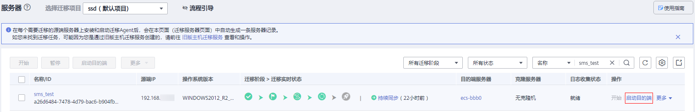
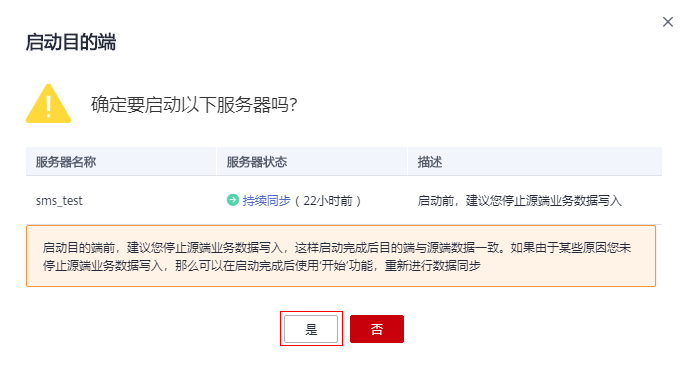

# 启动目的端

## 操作场景

您可以启动处于持续同步状态中的服务器，启动后会停止数据持续复制。 启动后如果还需要持续同步，请单击“开始”进行数据持续同步。

建议您在启动前单击“克隆服务器”克隆出一台新的弹性服务器进行测试，测试无误后再启动目的端。

> **说明：** 
>克隆出的服务器必须和目的端服务器在同一可用区，但可以处于另外一个VPC中。

## 前提条件

只有“迁移阶段 \> 迁移实时状态”为“持续同步”时才可启动目的端。

## 操作步骤

1.  登录管理控制台。
2.  单击“服务列表”，选择“迁移 \> 主机迁移服务”。

    进入“主机迁移服务”页面。

3.  单击“体验新版（NEW）”，进入新版主机迁移服务控制台。
4.  在左侧导航树中，选择“服务器”。

    进入服务器列表页面。

5.  在服务器列表页面找到已复制完成并持续同步的服务器，单击“操作”列下“更多 \> 启动目的端”。

    或勾选已复制完成并持续同步的服务器，单击服务器列表上方的“启动目的端”。

    **图 1**  启动目的端  
    

6.  在弹出的“启动目的端”页面，单击“是”。

    **图 2**  确定启动  
    

7.  当“迁移实时状态”为“已完成”，说明已启动目的端，整个迁移操作已完成。

