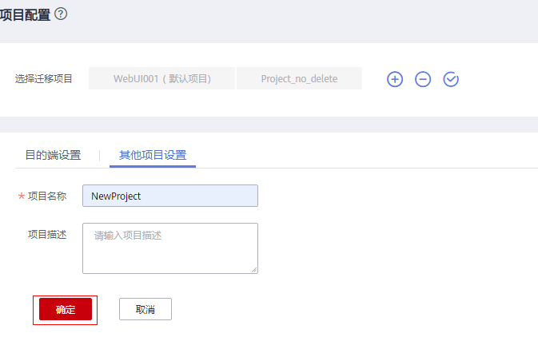
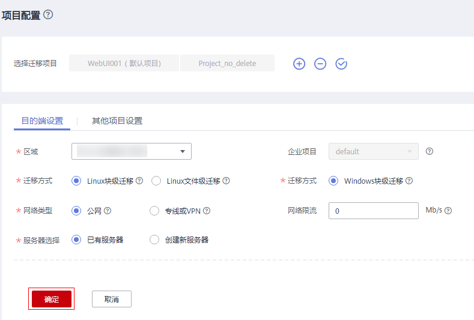

# 增加迁移项目

## 操作场景

每个迁移项目都可以设置目的端和其他项目设置，您可以通过项目来管理您的迁移项目。

## 新建项目

1.  登录管理控制台。
2.  单击“服务列表”，选择“迁移 \> 主机迁移服务”。

    进入“主机迁移服务”页面。

3.  单击“体验新版（NEW）”，进入新版主机迁移服务控制台。
4.  在左侧导航树中，选择“项目配置”。
5.  单击迁移项目名称右侧的，配置项目内容。
    1.  在其他项目设置页，输入项目名称、项目描述，设置完成后，单击“确定”。

        **图 1**  设置项目名称  
        

    2.  单击“目的端设置”，设置目的端详情，包括区域、迁移方式、网络类型、服务器选择等，具体内容详情请参见[6](设置目的端.md#zh-cn_topic_0253313951_li18203141120)，设置完成后，单击确定。

        **图 2**  目的端设置  
        

