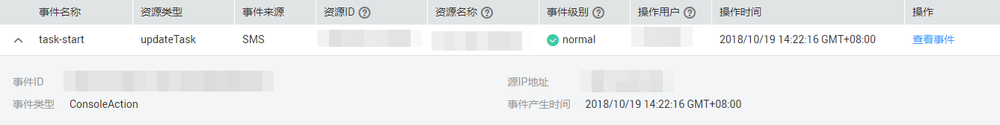

# 如何查看审计日志

## 操作场景

开启了云审计服务后，系统开始记录主机迁移服务相关的操作。云审计服务管理控制台保存最近7天的操作记录。

## 操作步骤

1.  登录管理控制台。
2.  在管理控制台左上角单击图标，选择“华北-北京一”。
3.  单击“服务列表”，选择“管理与部署 \> 云审计服务”，进入云审计服务信息页面。
4.  单击左侧导航树的“事件列表”，进入事件列表信息页面。
5.  单击事件列表右上方的“筛选”，设置对应的操作事件条件。当前事件列表支持四个维度的组合查询，详细信息如下：
    -   事件来源、资源类型和筛选类型。

        在下拉框中选择查询条件。其中，“事件来源”选择“SMS”。

        其中筛选类型选择事件名称时，还需选择某个具体的事件名称。

        选择资源ID时，还需选择或者手动输入某个具体的资源ID。

        选择资源名称时，还需选择或手动输入某个具体的资源名称。

    -   操作用户：在下拉框中选择某一具体的操作用户，此操作用户指用户级别，而非租户级别。
    -   事件级别：可选项为“所有事件级别”、“normal”、“warning”、“incident”，只可选择其中一项。
    -   时间范围：可选择查询最近七天内任意时间段的操作事件。

6.  在需要查看的记录左侧，单击展开该记录的详细信息。如[图1](#fig111431836194911)所示。

    **图 1**  展开记录  
    

7.  在需要查看的记录右侧，单击“查看事件”，弹出一个窗口，显示了该操作事件结构的详细信息。

