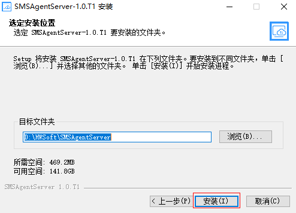

# 安装Agent批量管理工具

## 操作场景

当有大批量主机需要迁移到华为云时，一个一个安装代理/创建迁移任务，费时费力。因此，需要Agent批量工具来帮你解决。Agent批量安装工具主要功能为批量推送并安装代理，并且可以配置自动创建迁移任务，提升迁移效率。

## 前提条件

-   已准备好安装Agent批量管理工具的服务器并获得IP地址，最低规格为“1vCPUs | 2GB”、Windows 2008R2 64位以上操作系统。开放安全组“入方向”15302端口，“出方向”允许全部。并且关闭windows防火墙。
-   建议规格为“2vCPUs | 4GB”、带宽5M以上、Windows 2008R2 64位以上操作系统。

## 操作步骤

1.  登录管理控制台。
2.  单击“服务列表”，选择“迁移 \> 主机迁移服务”。

    进入“主机迁移服务”页面。

3.  在左侧导航树中，选择“迁移Agent”。

    进入“迁移Agent”页面。

4.  单击Agent Batch Installer下载下载窗格中的“下载”，下载SMSAgentServer-1.0.T1.exe到待安装Agent批量管理工具的服务器上。
5.  双击Agent批量管理工具SMSAgentServer-1.0.T1.exe，在安装界面，单击“下一步”。

    **图 1**  安装SMSAgentServer  
    

6.  在许可证协议界面，仔细阅读授权协议，勾选“我接受“许可证协议”中的条款（A）”，单击“下一步”。

    **图 2**  接受许可证协议  
    

7.  输入Agent管理中心的IP，如192.168.0.1，单击“下一步”。

    **图 3**  输入管理中心IP  
    

    > **说明：** 
    >-   IP不能为127.0.0.1和0.0.0.0，该IP需要Agent所在服务器能访问到，可以是弹性IP或私有IP。
    >-   192.168.0.1仅为示例说明，请根据实际IP填写。

8.  选择要安装SMSAgentServer-1.0.T1.exe的文件夹，单击“安装”，等待安装完成。

    **图 4**  安装  
    

9.  安装完成后，在浏览器中输入https://192.168.0.1:8443，若能正常访问，说明安装成功。

