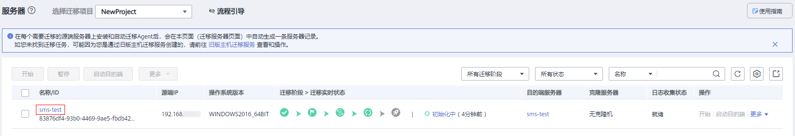

# 查看服务器详情

## 操作场景

安装并启动Agent后，迁移Agent会自动收集源端服务器信息并发送给主机迁移服务默认迁移项目下。您可以随时登录管理控制台查看服务器信息，包括源端服务器详情、目的端预设信息、迁移状态以及错误信息提示等。

## 操作步骤

1.  登录管理控制台。
2.  单击“服务列表”，选择“迁移 \> 主机迁移服务”。

    进入“主机迁移服务”页面。

3.  在左侧导航树中，选择“服务器”。

    进入服务器列表页面。

4.  单击要查看的服务器名称，进入服务器详情页面。

    **图 1**  单击服务器名称  
    

5.  服务器详情页面左侧，您可以分别查看源端服务器详情与目的端预设信息；页面右侧，您可以查看具体迁移状态，单击具体任务名称，可查看当前迁移进度。

    若出现错误时，单击具体的迁移任务名称，可查看具体错误信息。修改错误信息后，可重新迁移。

    **图 2**  查看服务器详情  
    

