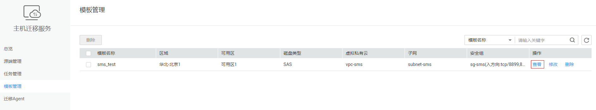

# 查看模板

## 操作场景

保存模板成功后，您可以随时登录管理控制台查看模板详情。

## 操作步骤

1.  登录管理控制台。
2.  单击“服务列表”，选择“迁移 \> 主机迁移服务”。

    进入“主机迁移服务”页面。

3.  在左侧导航树中，选择“模板管理”。

    进入“模板管理”页面。

4.  在“模板管理”页面单击模板名称操作列的“查看”，即可查看模板详情。

    **图 1**  查看模板  
    

