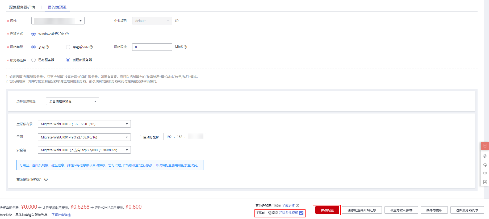

# 设置目的端

## 操作场景

迁移前，您需要设置目的端服务器。该目的端用来接收源端的数据，同时您也可以使用该目的端进行迁移测试和启动目的端。

## 前提条件

只有“迁移阶段 \> 迁移实时状态”为时才可设置目的端。

## 操作步骤

1.  登录管理控制台。
2.  单击“服务列表”，选择“迁移 \> 主机迁移服务”。

    进入“主机迁移服务”页面。

3.  单击“体验新版（NEW）”，进入新版主机迁移服务控制台。
4.  在左侧导航树中，选择“服务器”。

    进入服务器列表页面。

5.  在服务器列表页面找到待迁移的服务器，在“目的端服务器”列下单击，设置目的端服务器。

    或单击服务器列表页“操作”列的“更多 \> 设置目的端”，设置目的端服务器。

    **图 1**  设置目的端  
    

6.  在“目的端预设”页面，根据页面提示，设置目的端相关参数，如所示。

    **图 2**  目的端预设  
    

    1.  设置“区域”，选择目的端服务器所在区域。

        > **说明：** 
        >区域默认为当前迁移项目设置的区域，您可以根据业务要求，选择具体的区域。

    2.  选择迁移方式。
        -   Linux块级：Linux块级迁移是指全量复制和持续同步的最小粒度为磁盘逻辑单位"块"。这种方式同步效率高，但兼容性差。
        -   Linux文件级：Linux块级迁移是指全量复制和持续同步最小粒度为文件，这种方式同步效率低，但兼容性好。
        -   Windows块级：Windows块级迁移是指全量复制和持续同步的最小粒度为磁盘逻辑单位"块"。Windows当前仅支持块级迁移，这种迁移方式迁移和同步效率高。

    3.  选择“网络类型”。
        -   公网：若使用公网迁移，要求目的端服务器配置有“弹性IP”。“迁移网络类型”默认设置为公网。
        -   专线或VPN：需要您提前创建源端服务器到目的端服务器所在VPC子网的专线或VPN。
        -   网络限流：您可以根据要迁移的源端带宽大小及业务要求，设置限制带宽大小。

            > **说明：** 
            >若源端和目的端都在同一个VPC内，网络类型可选择“专线或VPN”。

    4.  服务器选择。
        -   已有服务器

            目的端服务器需要满足如下条件，否则请单击“前往ECS购买”，根据“推荐参数”并参见[购买弹性云服务器](https://support.huaweicloud.com/qs-ecs/ecs_02_0009.html)创建满足如下条件的弹性云服务器。

            > **说明：** 
            >当前已支持将源端服务器迁移到“包年/包月”和“按需计费”这两种计费模式的弹性云服务器，您可根据需求选择对应计费模式的弹性云服务器。

            -   Windows系统的目的端服务器（即弹性云服务器）“规格”中的“内存”大小要不小于2GB。
            -   目的端服务器的磁盘个数不小于源端服务器磁盘个数，且目的端服务器每块磁盘的大小要不小于“源端管理”中相对应的源端服务器“推荐规格”大小。
            -   目的端服务器的镜像类型需要和源端的OS类型保持一致。否则，迁移完成后服务器OS系统类型与镜像类型不一致，造成名字冲突及其他问题。
            -   确保源端服务器可以访问目的端服务器，即要有可用的EIP，或者配置VPN、专线。
            -   确保目的端服务器所在VPC安全组配置准确。需配置目的端服务器所在VPC安全组，如果是Windows系统，开放TCP的8899端口和8900端口；如果是Linux系统，[迁移方式](#zh-cn_topic_0253313951_li4588185602919)选择Linux文件级，开放22端口，[迁移方式](#zh-cn_topic_0253313951_li4588185602919)选择Linux块级，开放8900、22端口。

                请参见[如何配置目的端服务器安全组规则？](https://support.huaweicloud.com/sms_faq/sms_faq_0011.html)配置安全组规则。

        -   创建新服务器
            -   未选择模板时，虚拟私有云、网卡与安全组默认为自动创建，也可以根据需求手动选择。高级配置中名称、可用区、规格、系统盘、弹性公网IP默认自动推荐和选择，也可以根据需求手动选择。
            -   选择已有模板时，区域、虚拟私有云、网卡、安全组、可用区、磁盘类型根据模板确定。

                > **说明：** 
                >-   虚拟私有云选择自动创建时，SMS会帮助用户创建一个VPC：
                >    若源端IP是192.168._X.X_，则推荐创建的VPC网段是192.168.0.0/16，同时创建一个子网，网段也是192.168.0.0/16。
                >    若源端IP是172.16._X.X_，则推荐创建的VPC网段是172.16.0.0/12，同时创建一个子网，网段也是172.16.0.0/12。
                >    若源端IP是10._X_._X.X_，则推荐创建的VPC网段是10.0.0.0/8，同时创建一个子网，网段也是10.0.0.0/8。
                >-   安全组选择自动创建时，则SMS服务会自动创建一个安全组，并根据SMS的需要开放端口，Windows开放8899、8900端口，Linux文件级迁移开放22端口，Linux块级迁移开放8900、22端口。
                >-   当源端在华为云并且安装Cloudinit，创建新服务器后的密码为1 + sk前八位 + !。如sk前八位为RgybsdPP，则密码为1RgybsdPP!。
                >    其他情况，迁移完成后，目的端账号密码与源端保持一致。

    5.  参数设置完成以后，仔细阅读并勾选“迁移前，请阅读迁移条件须知”，单击“保存目的端配置”。

        > **说明：** 
        >请单击“迁移条件须知”，打开并仔细阅读此内容。

    6.  当服务器列表中“迁移阶段 \> 迁移实时状态”列显示为，说明目的端已配置完成。

