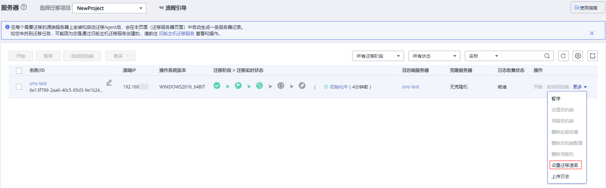

# 设置迁移速率

## 操作场景

迁移过程中会消耗大量的流量和带宽，为了减少迁移对业务的影响，通过以下方法来限制迁移的速率。

## 操作步骤

1.  登录管理控制台。
2.  单击“服务列表”，选择“迁移 \> 主机迁移服务”。

    进入“主机迁移服务”页面。

3.  在左侧导航树中，选择“服务器”。

    进入服务器列表页面。

4.  在服务器列表页面选择需要设置迁移速率的服务器，单击“操作”列下“更多 \> 设置迁移速率”。

    **图 1**  设置迁移速率  
    

    > **说明：** 
    >迁移速率限制”的取值范围为“0至1000”之间的整数。
    >-   当输入为0或输入为空表示不限制迁移速率，此时的迁移速率为源端到目的端的网络速率。
    >-   当输入的数值为“1至1000”的某个整数V1时，则限制最大的迁移速率为V1，且假设当前源端到目的端的网络速率为V2，则当前实际的迁移速率为V1与V2中的较小值。

5.  在弹出的“设置迁移速率”页面，单击“确认”。

    **图 2**  设置  
    

