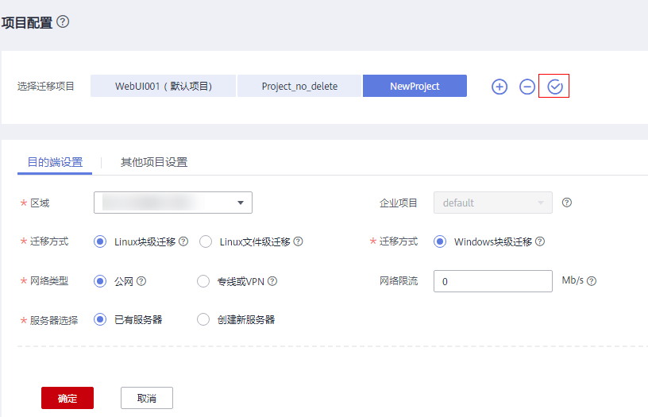

# 设置默认迁移项目

设置默认迁移项目后，每次初始加载或者刷新服务器页面都会自动选择该默认迁移项目，且新添加的服务器会自动注册到该默认迁移项目下。

## 设置默认迁移项目

1.  登录管理控制台。
2.  单击“服务列表”，选择“迁移 \> 主机迁移服务”。

    进入“主机迁移服务”页面。

3.  在左侧导航树中，选择“项目配置”。
4.  选择要设置为默认迁移项目名称，单击名称右侧的。

    **图 1**  设置默认迁移项目  
    

5.  在弹出的设置默认项目页，单击**“是”**。

    **图 2**  确定  
    

